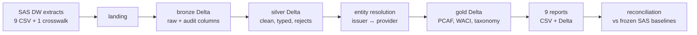

# x-pankki ESG — SAS to Databricks reference implementation

This project is a complete, local walkthrough of migrating a bank's legacy SAS ESG reporting onto Azure Databricks. Nine SAS data-warehouse extracts land as CSV, move through a bronze / silver / gold Delta lakehouse, and produce nine regulatory reports. A reconciliation step compares the new output to frozen "legacy SAS" baselines so you can see what cutover actually looks like. Everything runs on your laptop with PySpark and Delta Lake; the same modules deploy to Databricks by changing `conf/config.yaml` (or `XPANKKI_ENV`), not by rewriting transformations.

## Run it in three commands

Prerequisites: Python 3.11 and a JDK 11 or 17 (`java -version` must work — PySpark will not start without it).

```bash
cd ~/Desktop/x-pankki_project
make setup      # venv + pinned packages
make generate   # synthetic SAS extracts + frozen baselines
make run        # bronze → silver → gold → 9 reports
```

Then, when you want to prove the migration:

```bash
make recon      # new output vs frozen SAS baselines (7 pass, 2 seeded diffs)
make test       # unit + smoke tests
```

Default reporting date is **2025-12-31**. Override it on the CLI:

```bash
python -m xpankki_esg.pipeline run --layer all --as-of 2025-12-31
```

## Flow



Local vs Databricks: locally, "schemas" are folders under `data/lakehouse/`. On Databricks they are Unity Catalog schemas. Restricted MSCI data always lives in `esg_restricted`, which maps to a separately granted UC schema. See [docs/01_architecture.md](docs/01_architecture.md) and [docs/07_databricks_deployment.md](docs/07_databricks_deployment.md).

## What you get

| Layer | What it is |
|---|---|
| Landing | CSV files as if the SAS DW dropped them overnight. One table uses SAS `DATE9.` dates; others use ISO. |
| Bronze | Byte-for-byte source plus `_ingested_at`, `_source_file`, `_batch_id`. No cleaning. |
| Silver | Types, dedup, validity windows. Rejected rows go to `_rejects` with a reason — nothing is dropped silently. |
| Gold | Reusable PCAF attribution, data-quality scores, WACI, taxonomy alignment. |
| Reports R01–R09 | Slice and aggregate gold. Each module has the same five-step shape. |
| Recon | Compares each report to a frozen baseline using the tolerance in that report's YAML. |

The nine reports cover financed emissions (equity, bonds, loans), PCAF data quality, WACI, SFDR PAI 1–4, EU taxonomy alignment, and coverage.

## Project layout

```
conf/                  environment, source contracts, one YAML per report
src/xpankki_esg/       the pipeline (plain functions, no frameworks)
docs/                  architecture, data model, SAS→PySpark mapping, runbook
notebooks/             thin Databricks wrappers; the CLI is the real entry point
tests/                 entity resolution, PCAF, data quality, report smoke tests
data/                  created at runtime, git-ignored
```

Start with [docs/04_sas_to_pyspark_mapping.md](docs/04_sas_to_pyspark_mapping.md) if you know SAS and not Spark.

## Commands (full list)

```bash
python -m xpankki_esg.pipeline generate --as-of 2025-12-31
python -m xpankki_esg.pipeline run --layer bronze --as-of 2025-12-31
python -m xpankki_esg.pipeline run --layer all --as-of 2025-12-31
python -m xpankki_esg.pipeline run --report R01 --as-of 2025-12-31
python -m xpankki_esg.pipeline recon --as-of 2025-12-31
```

`make clean` deletes generated data and keeps the virtualenv.

## Design rules (so the demo stays teachable)

- Simple functions and modules. Configuration is YAML, not a plugin system.
- Every transformation docstring states the business question; numbered comments explain the *why*.
- Where a PCAF/SFDR rule is simplified, the code and the docs both say `# SIMPLIFIED:`.
- Synthetic data uses a fixed seed (`random_seed: 42` in `conf/config.yaml`).
- Assumptions are collected in `docs/assumptions.md` rather than buried in code.
