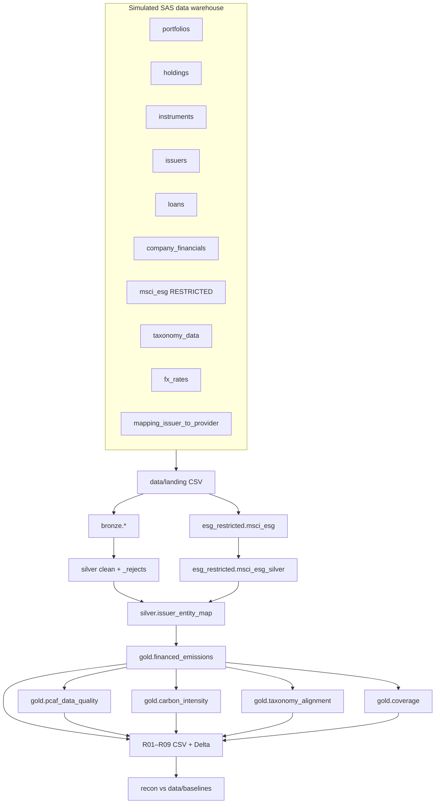
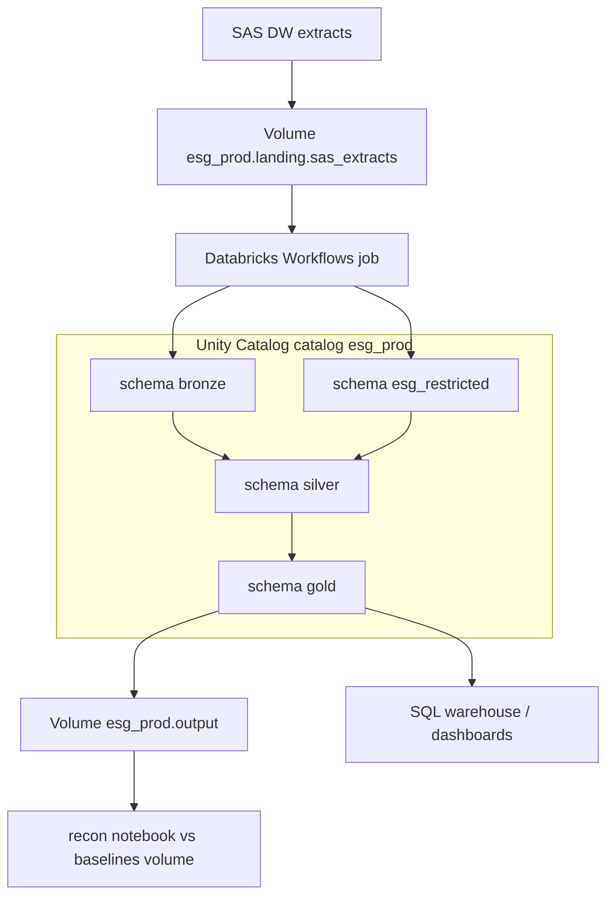

# Architecture

The reporting chain is the same idea a finance team already knows from a SAS job: files arrive overnight, they are checked, numbers are calculated, reports go out. Here those stages are named bronze, silver and gold so they map 1:1 onto a Databricks lakehouse. Locally, each “schema” is a folder on disk. On Databricks, the same names become Unity Catalog schemas; the Python does not change.

## For business readers

- **Landing** is the inbox: CSV extracts as if the SAS data warehouse dropped them.
- **Bronze** is the archive: we store the file unchanged and stamp who ingested it and when. If a number is later disputed, we can show the original extract.
- **Silver** is operations: types, duplicates, invalid loans, bad taxonomy shares. Rejected rows are written to a rejects table with a reason. Nothing disappears.
- **Gold** is finance: PCAF attribution, data-quality scores, WACI, taxonomy. Calculated once, reused by every report.
- **Reports R01–R09** are the packs you would send to disclosure. They only slice and total gold; they do not invent new maths.
- **Reconciliation** is cutover control: new CSV versus frozen “legacy SAS” CSV, with a tolerance per report.

Licensed MSCI-style emissions data never sits in the open gold folder. It lives in `esg_restricted`, which on Databricks is a schema with its own grants.

## Local pipeline (what this laptop actually runs)



### What is simulated locally

| Piece | Local stand-in | Real Databricks equivalent |
|---|---|---|
| SAS DW overnight drop | `make generate` writes CSVs | ADF / storage event / volume file arrival |
| Storage | folders under `data/lakehouse/` | Unity Catalog managed tables + Volumes |
| Restricted vendor data | folder `esg_restricted/` | UC schema `esg_prod.esg_restricted` with grants |
| Job scheduler | `make run` / CLI | Databricks Workflows job with a monthly schedule |
| Cluster | local Spark `local[*]` | job cluster (see [07_databricks_deployment.md](07_databricks_deployment.md)) |
| Identity / secrets | none | Azure AD + Databricks secrets |
| Frozen SAS baselines | mutated copies of this pipeline | exports from the actual SAS system |

Synthetic data uses a fixed random seed (`42`) so every generate run is identical. That is required for a repeatable demo; production would use real extracts.

## Target Databricks architecture (what we would deploy)



Catalog and schema names are set in `conf/config.yaml` under `databricks:`. The code calls `table_identifier()`, which returns `esg_prod.silver.holdings` on Databricks and a folder path locally.

## Layer rules (so the demo stays honest)

1. **Bronze does not clean.** If the SAS extract has a trailing space or a SAS `DATE9.` date, bronze keeps it. Audit columns: `_ingested_at`, `_source_file`, `_batch_id`.
2. **Silver is the only place rows may be rejected.** Reasons today: missing market value, negative loan outstanding, taxonomy aligned share greater than eligible share. See `data/lakehouse/silver/_rejects`.
3. **Gold is reusable maths.** Report modules must not re-implement PCAF. If two reports need financed emissions, they both read `gold.financed_emissions`.
4. **Restricted data stays restricted.** `msci_esg` is ingested into `esg_restricted`, cleaned there, and joined in gold. We never copy vendor emissions into an open bronze copy.

Why this split: [adr/0001-medallion-architecture.md](adr/0001-medallion-architecture.md) and [adr/0002-restricted-msci-data-isolation.md](adr/0002-restricted-msci-data-isolation.md).

## How an operator starts it

```bash
make setup      # once per machine
make generate   # synthetic SAS files + frozen baselines
make run        # bronze → silver → gold → nine reports
make recon      # compare to baselines
```

Details and failure handling: [05_runbook.md](05_runbook.md).
