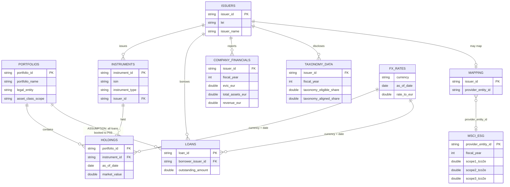

# Data model

The bank already has portfolios, holdings, loans and issuer master data in SAS. ESG adds two extra ideas: a licensed vendor table that does not use our issuer ids, and a crosswalk that is never complete. This document names every table, how they join, and where data-quality issues are expected. It matches the code; it is not a generic textbook model.

## For business readers

Think of four groups of tables:

1. **The book** — what we own or have lent (`portfolios`, `holdings`, `instruments`, `loans`).
2. **The counterparties** — who issued the security or borrowed the money (`issuers`, `company_financials`).
3. **The vendor** — MSCI-style emissions and ratings, keyed by *their* entity id (`msci_esg`), plus our incomplete map (`mapping_issuer_to_provider`).
4. **The helpers** — FX into euro, EU taxonomy shares.

Entity resolution answers: “For this internal issuer, do we have a usable MSCI row this year?” If not, we still keep the position and label the gap (`unmapped_issuer` or `orphan_provider`). Financed-emissions reports only attribute where the map worked; R09 shows the rest.

## Entity-relationship diagram



## Source tables (landing / bronze)

Contracts live in `conf/sources.yaml`. Bronze stores every column as text plus audit fields.

| Table | Grain | What a business user would call it | Quality issue planted in the demo |
|---|---|---|---|
| `portfolios` | 1 row per portfolio | The four books (equity, credit, loans, mixed) | Trailing space on one legal entity |
| `holdings` | portfolio × instrument × date | Positions in funds | One duplicate row; one missing market value; one prior-year row |
| `instruments` | 1 row per security | ISIN, type (equity / bond), issuer | Mixed-case ISINs and spaces |
| `issuers` | 1 row per company | Name, country, NACE, LEI | One missing LEI (kept, flagged) |
| `loans` | 1 row per loan | Business-loan outstanding | One negative outstanding (rejected) |
| `company_financials` | issuer × year | EVIC, assets, revenue | One issuer with EVIC = 0 |
| `msci_esg` | vendor entity × year | **Restricted** emissions and fossil flag | Missing Scope 3; null rating |
| `taxonomy_data` | issuer × year | Eligible / aligned shares | One row with aligned > eligible (rejected) |
| `fx_rates` | currency × date | Rate into EUR | Dates in SAS `DATE9.` (`31DEC2025`) |
| `mapping_issuer_to_provider` | 1 row per mapped issuer | Internal id → MSCI id | Incomplete; one maps to a provider that does not exist |

**ASSUMPTION:** the loans extract has no `portfolio_id`. All surviving loans are booked to P03 (Business Lending). See [assumptions.md](assumptions.md).

## Silver model (cleaned, still at source grain)

Silver keeps the same business keys after typing and trimming. Extra tables:

| Table | Purpose |
|---|---|
| `silver._rejects` | Rows that failed a rule, with `reject_reason` and a JSON `details` payload |
| `silver.issuer_entity_map` | Every issuer plus `coverage_status`: `mapped`, `unmapped_issuer`, or `orphan_provider` |
| `esg_restricted.msci_esg_silver` | Typed MSCI data, still in the restricted schema |

Coverage status in plain language:

- **mapped** — we have a crosswalk and that vendor id exists in MSCI for the fiscal year.
- **unmapped_issuer** — no row in the crosswalk (ISS006 and ISS007 in the demo).
- **orphan_provider** — we mapped to an id that is not in MSCI (ISS010 → PROV999).

## Gold model (calculations, reused by reports)

| Table | Grain | Business content |
|---|---|---|
| `gold.financed_emissions` | one row per position (holding or loan) on the as-of date | Exposure in EUR, attribution factor, financed tCO2e, PCAF score |
| `gold.pcaf_data_quality` | portfolio × asset class | Exposure-weighted PCAF score and coverage % |
| `gold.carbon_intensity` | portfolio | WACI and carbon footprint |
| `gold.taxonomy_alignment` | portfolio | Eligible / aligned shares of AUM |
| `gold.coverage` | same as financed_emissions, plus `gap_cause` | Input to R09 |
| `gold.r01` … `gold.r09` | report grain | Also written as `data/output/R0N.csv` |

### Attribution (plain language)

- **Listed equity and corporate bonds:**  
  `our holding in EUR ÷ company EVIC in EUR × company emissions`.  
  If EVIC is zero or missing, we do not attribute; R09 labels `zero_or_missing_denominator`.
- **Business loans:**  
  `outstanding in EUR ÷ company total assets × company emissions`.

**SIMPLIFIED:** real PCAF converts EVIC into the holding currency at the reporting-date FX and has a fuller scorecard (1a, 1b, 2a, … 5). This demo converts everything to EUR first and uses a four-rule score. Details: [03_report_catalog.md](03_report_catalog.md).

## How entity resolution links the chain

```text
holding / loan
    → instrument.issuer_id  or  loan.borrower_issuer_id
        → issuers.issuer_id
            → mapping.provider_entity_id     (may be missing)
                → msci_esg.provider_entity_id  (may not exist)
                    → scope 1/2/3, fossil flag, rating
```

A SAS developer would recognise this as several `MERGE … BY` steps. The PySpark lives in `src/xpankki_esg/silver/entity_resolution.py` and `gold/pcaf.py`. Side-by-side SAS: [04_sas_to_pyspark_mapping.md](04_sas_to_pyspark_mapping.md).
